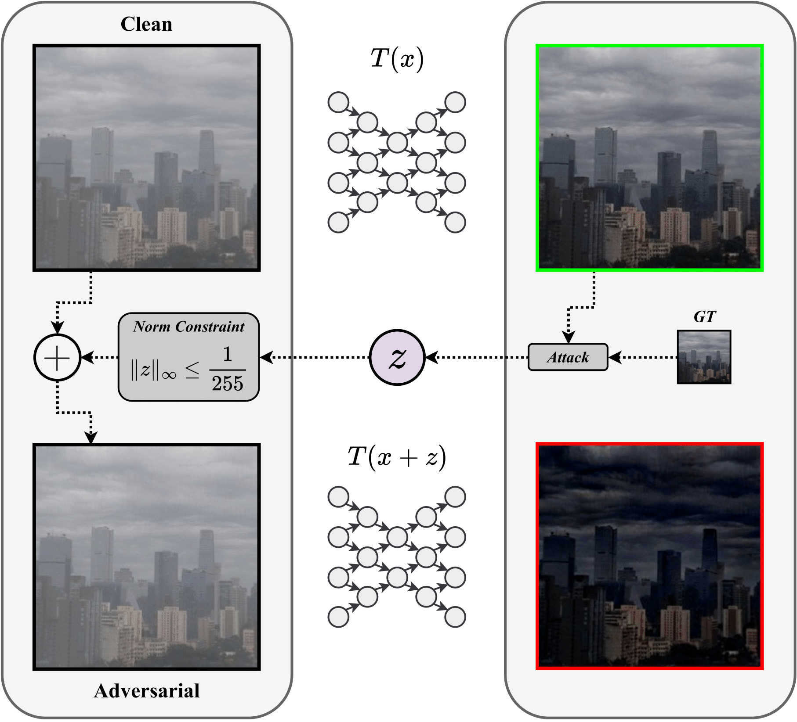

# Robust Single-Image Dehazing

This repo contains the source code for:

```
Fine-Tuning Adversarially-Robust Transformers for Single-Image Dehazing,

V. Vasilescu, A. Neacșu, D. Faur
```

accepted at [IGARSS 2025](https://2025.ieeeigarss.org/index.php).

<div style="text-align: center;">
  
</div>

Training is solely performed on the [RESIDE-Outdoor](https://sites.google.com/view/reside-dehaze-datasets/reside-v0) dataset. You should modify accordingly the path to your dataset(s) in `./configs/data/*.yaml` files.

## Fine-tuning:

Before anything, you should have in `./saved_models/base` the corresponding checkpoints of architectures you want to fine-tune. Each `{model_name}.pth` should have a corresponding `./configs/base/{model_name}.json` config file.

```bash
python tune.py <fine_tuning_config>
```
where `fine_tuning_config` is the name of a `.json` configuration file from `./configs/finetune`.

## Testing:

### 1. Base models:
```bash
python test.py --model <model_name> 
```

or, for adversarial verification:

```bash
python test_adversarial.py --model <model_name> --attack_config <path_to_attack_config>
```
where `model_name` is the checkpoint name placed in `./saved_models/base`. All attack configurations are placed in `./configs/attacks`.


### 2. Fine-tuned models:
```bash
python test.py --model <model_name> --fine_tuned
```

or, for adversarial verification:

```bash
python test_adversarial.py --model <model_name> --fine_tuned --attack_config
```
where `model_name` is the folder name placed in `./saved_models/fine_tuned`.

Everything you test will be saved in:

`./results/{dataset_name}/{base or fine_tuned}/{model_name}`

**Note**: fine-tuned checkpoint in the corresponding folder should be named `fine_tuned.ckpt`. Each folder contains a `setting.yaml` file with everything needed for loading the fine-tuned model. 

---

## Contact

[vasilescuvladmihai@gmail.com](mailto:vasilescuvladmihai@gmail.com)   
[vlad.vasilescu2111@upb.ro](mailto:vlad.vasilescu2111@upb.ro)


## Acknowledgments 

- [PyTorch Lightning](https://lightning.ai/docs/pytorch/stable/)
- The code organisation of this repo relies on [DehazeFormer](https://github.com/IDKiro/DehazeFormer?tab=readme-ov-file)
- [ICCV-2023-MB-TaylorFormer](https://github.com/FVL2020/ICCV-2023-MB-TaylorFormer/tree/main), for open-sourcing their project